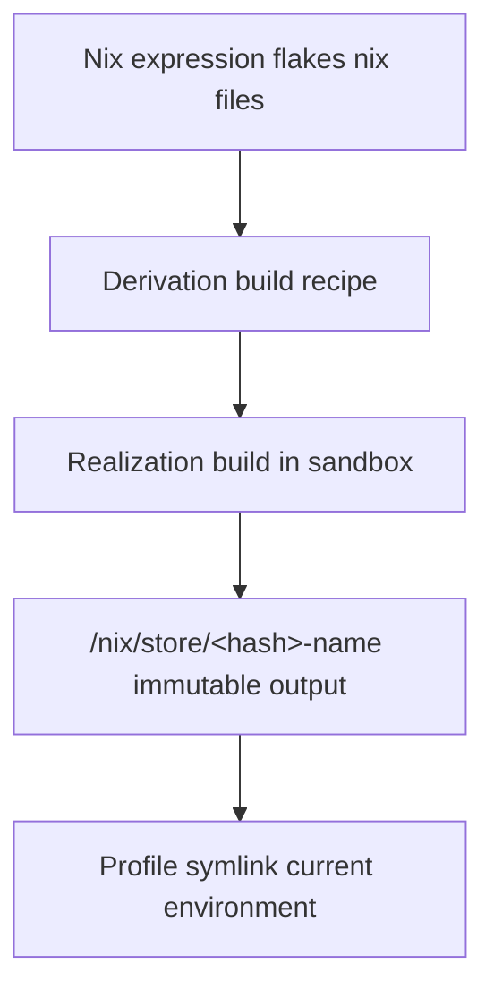

# What is nix?

### A Toolchain for Reproducible Systems

- a package manager
- a build system
- a configuration language

### The Problem Nix Focuses On

Given the same inputs, we want the same result — every time.

#### Inputs

- source code
- dependencies
- compilers
- build tools
- system libraries

Most tools only control some of these.
Nix tries to control all of them.

Core Idea

Instead of mutating a system step by step,
Nix describes what the system should be, and builds it from explicit inputs.

This is what enables reproducibility.

### How Nix Works: Store + Derivations



### The Nix Store

All build outputs live in a single place: `/nix/store`

Each output path includes a hash

The hash is derived from:

- inputs
- dependencies
- build instructions

Example shape:

```
/nix/store/<hash>-openssl-3.0.12
```

Why This Matters

- Multiple versions can exist at the same time
- Nothing is overwritten
- No accidental upgrades
- Rollbacks are trivial

If the inputs change, the path changes.
If the path didn’t change, the inputs didn’t either.

_**Key Property:** The filesystem path is a proof of how something was built._
